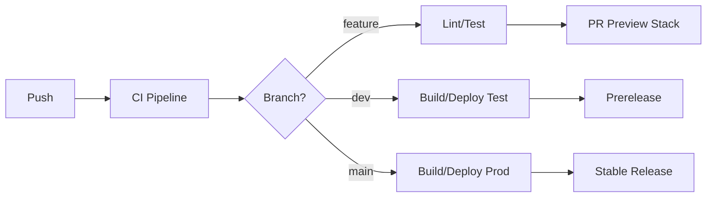

# CI/CD Pipeline

Pantstack uses GitHub Actions for continuous integration and deployment with automated versioning and multi-environment support.

## Pipeline Overview



## Workflow Files

### Core Workflows

#### CI Pipeline (`.github/workflows/ci.yml`)
Runs on all pushes and PRs:
- Linting with Pants
- Type checking
- Unit tests
- Docker image building
- Artifact upload

#### Auto-Deploy Dev (`.github/workflows/auto-deploy-dev.yml`)
Triggers on dev branch pushes:
- Creates prerelease versions (e.g., 1.2.0-dev.3)
- Deploys to test environment
- Updates changelog
- Tags Docker images

#### Auto-Deploy Main (`.github/workflows/auto-deploy-main.yml`)
Triggers on main branch merges:
- Creates stable releases (e.g., 1.2.0)
- Deploys to production environment
- Creates GitHub release
- Tags Docker images

#### PR Preview (`.github/workflows/pr-preview.yml`)
Creates ephemeral stacks for pull requests:
- Deploys PR code to isolated stack
- Comments deployment URL on PR
- Auto-cleanup on PR close

### Supporting Workflows

#### Semantic PR (`.github/workflows/semantic-pr.yml`)
Enforces conventional commit format in PR titles:
- `feat:` for features
- `fix:` for bug fixes
- `docs:` for documentation
- `chore:` for maintenance

## Branch Strategy

### Development Flow
```
feature/* ──PR──> dev ──PR──> main
    │              │            │
    └─ Preview     └─ Test      └─ Production
```

### Branch Purposes
- **feature/\***: Development branches for new features
- **dev**: Integration branch for testing
- **main**: Production-ready code
- **hotfix/\***: Emergency fixes to production

## Versioning Strategy

### Semantic Versioning
Automated versioning based on conventional commits:

| Commit Type | Version Bump | Example |
|------------|--------------|---------|
| `feat:` | Minor | 1.2.0 → 1.3.0 |
| `fix:` | Patch | 1.2.0 → 1.2.1 |
| `feat!:` or `BREAKING CHANGE:` | Major | 1.2.0 → 2.0.0 |
| `chore:`, `docs:` | None | No version change |

### Release Labels
Override automatic versioning with PR labels:
- `release:major` - Force major version bump
- `release:minor` - Force minor version bump
- `release:patch` - Force patch version bump
- `release:skip` - Skip version bump

### Prerelease Versions
Dev branch creates prereleases:
```
1.2.0 → 1.3.0-dev.1 → 1.3.0-dev.2 → 1.3.0
```

## GitHub Actions Secrets

### Required Secrets
```yaml
# Repository secrets
AWS_ACCOUNT_ID: "123456789012"
AWS_REGION: "us-east-1"
PULUMI_ACCESS_TOKEN: "pul-xxxxx"
ECR_REGISTRY: "123456789012.dkr.ecr.us-east-1.amazonaws.com"
ECR_REPOSITORY: "pantstack"
```

### OIDC Authentication
Uses GitHub OIDC provider for AWS access:
```yaml
- uses: aws-actions/configure-aws-credentials@v4
  with:
    role-to-assume: arn:aws:iam::${{ secrets.AWS_ACCOUNT_ID }}:role/github-actions-role
    aws-region: ${{ secrets.AWS_REGION }}
```

## CI Pipeline Details

### Lint & Format
```yaml
- name: Lint and Format
  run: |
    pants lint ::
    pants fmt --check ::
```

### Type Checking
```yaml
- name: Type Check
  run: pants check ::
```

### Testing
```yaml
- name: Run Tests
  run: |
    pants test ::
    pants test --use-coverage ::
```

### Building
```yaml
- name: Build Docker Images
  run: |
    pants package ::
    pants publish :: --to=$ECR_REGISTRY/$ECR_REPOSITORY
```

## Deployment Process

### Test Environment Deployment
1. Push to dev branch triggers workflow
2. Semantic release creates prerelease version
3. Docker images built and pushed to ECR
4. Pulumi deploys to test environment
5. Smoke tests run against deployment

### Production Deployment
1. PR from dev to main with release label
2. On merge, semantic release creates stable version
3. Docker images tagged with version
4. Pulumi deploys to production
5. Health checks verify deployment
6. GitHub release created with changelog

### Rollback Procedure
```bash
# Revert to previous version
pulumi stack select prod
pulumi preview --refresh
pulumi up --target "aws:ecs/service:api-service" \
  --config="imageTag=v1.2.3"
```

## PR Preview Stacks

### Lifecycle
1. **PR Created**: Preview stack deployed
2. **PR Updated**: Stack updated with changes
3. **PR Merged**: Stack marked for deletion
4. **PR Closed**: Stack destroyed

### Preview URL Format
```
https://preview-pr-123.pantstack.dev
```

### Resource Limits
- Max 3 preview stacks per repository
- Auto-cleanup after 7 days of inactivity
- Reduced resource allocation vs production

## Monitoring & Notifications

### Build Status
- GitHub commit status checks
- PR comment with deployment URLs
- Slack notifications (optional)

### Deployment Tracking
```yaml
- name: Create Deployment
  uses: actions/github-script@v6
  with:
    script: |
      await github.rest.repos.createDeployment({
        owner: context.repo.owner,
        repo: context.repo.repo,
        ref: context.sha,
        environment: 'production',
        auto_merge: false,
        required_contexts: [],
      });
```

## Security Considerations

### Secret Management
- No hardcoded secrets in workflows
- Use GitHub secrets for sensitive data
- Rotate tokens regularly
- Audit secret access logs

### Workflow Permissions
```yaml
permissions:
  contents: read
  packages: write
  id-token: write  # For OIDC
  deployments: write
```

### Branch Protection
- Require PR reviews for main branch
- Enforce status checks before merge
- Dismiss stale reviews on updates
- Require up-to-date branches

## Troubleshooting

### Common Issues

#### Build Failures
```bash
# Check Pants logs
pants --no-pantsd test :: -ldebug

# Clear Pants cache
rm -rf ~/.cache/pants
```

#### Deployment Failures
```bash
# Check Pulumi state
pulumi stack --show-ids
pulumi refresh --yes

# Force update
pulumi up --force --yes
```

#### Version Conflicts
```bash
# Reset version tags
git tag -d v1.2.3
git push origin :refs/tags/v1.2.3
```
